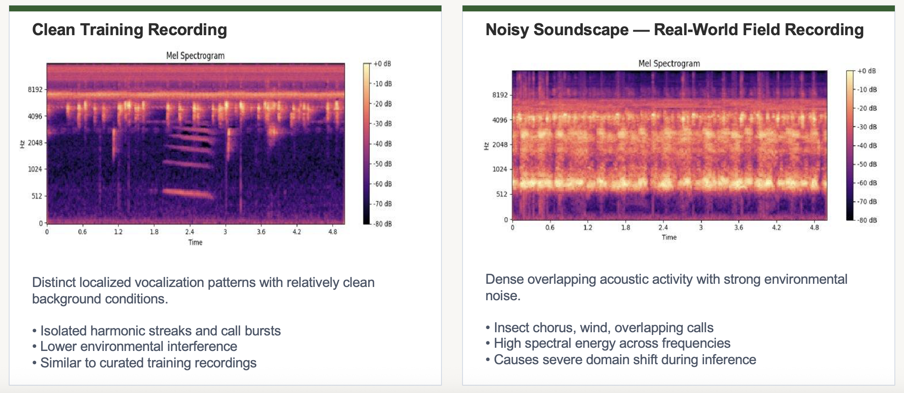
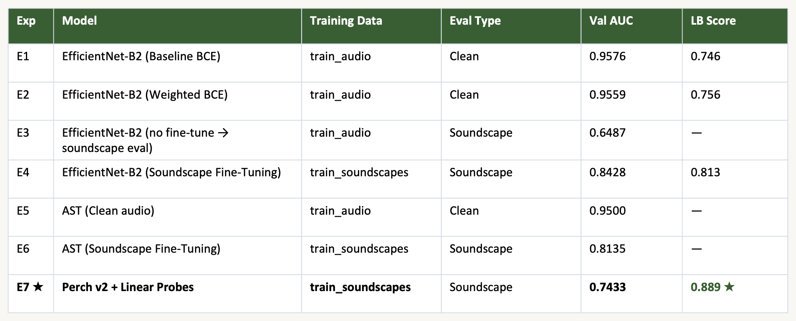
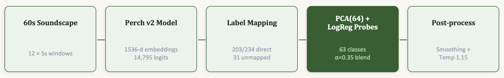
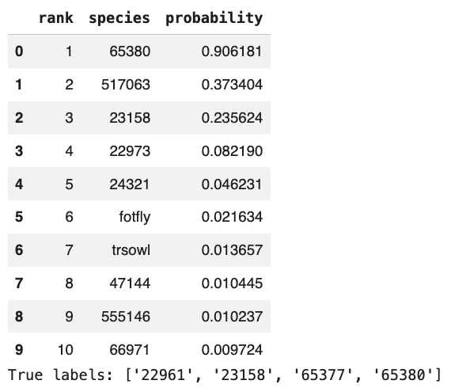
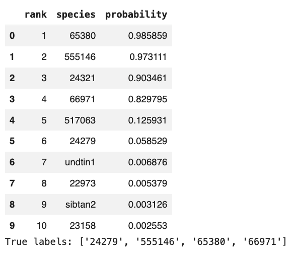

# BirdCLEF 2026 Audio Classification

A deep learning project for **multi-label wildlife species identification from passive acoustic recordings** developed for the BirdCLEF 2026 Kaggle competition.

The project explores **EfficientNet-B2**, **Audio Spectrogram Transformer (AST)**, soundscape domain adaptation, ensemble inference, and **Google Perch v2** for classification under noisy real-world acoustic conditions.

---

## Overview

BirdCLEF 2026 requires models to identify **234 target species** from 5-second windows of environmental soundscape recordings collected in Brazil's Pantanal wetlands.

A central challenge is the domain gap between relatively clean training recordings and real-world soundscapes containing overlapping vocalizations, insects, wind, and other background noise.

This project investigates multiple approaches for improving generalization to these challenging soundscapes.

---

## Key Approaches

* EfficientNet-B2 with ImageNet transfer learning
* Mel spectrogram-based audio classification
* Weighted Binary Cross-Entropy for class imbalance
* Supervised soundscape fine-tuning
* Audio Spectrogram Transformer experiments
* Ensemble inference
* Perch v2 bioacoustic embeddings with linear probes

---

## Repository Structure

```text
birdclef-2026-audio-classification/
│
├── notebooks/
│   ├── Group_Programming_07_Code.ipynb
│   ├── birdclef_2026_perch_v2_Colab.ipynb
│   └── EfficientNet_Soundscape_Inference.ipynb
│
├── results/
│   ├── clean_vs_noisy_spectrogram.png
│   ├── experiment_summary.png
│   ├── perch_v2_pipeline.png
│   ├── topk_prediction_sample1.png
│   └── topk_prediction_sample2.png
│
├── docs/
│   └── Birdclef_Project_Final_Report.pdf
│
├── requirements.txt
└── README.md
```

---

## Data Processing

Audio recordings are processed using the following pipeline:

1. Resample audio to **32 kHz mono**
2. Trim or pad recordings into **5-second windows**
3. Generate **128-bin mel spectrograms**
4. Convert spectrogram power to decibel scale
5. Normalize and resize to **224 × 224**
6. Replicate into three channels for ImageNet-pretrained models
7. Apply time and frequency masking during training

---

## Clean vs. Soundscape Audio

<p align="center">
  
</p>

Clean training recordings generally contain isolated vocalizations, while field soundscapes contain overlapping calls and substantial environmental noise. This domain shift became one of the main challenges addressed in the project.

---

## Experimental Results

| Experiment | Model                                  | Evaluation |        AUC | Kaggle LB |
| ---------- | -------------------------------------- | ---------- | ---------: | --------: |
| E1         | EfficientNet-B2 Baseline               | Clean      | **0.9576** |     0.746 |
| E2         | EfficientNet-B2 Weighted BCE           | Clean      | **0.9559** |     0.756 |
| E3         | Baseline without fine-tuning           | Soundscape | **0.6487** |         — |
| E4         | EfficientNet-B2 Soundscape Fine-Tuning | Soundscape | **0.8428** |     0.813 |
| E5         | AST                                    | Clean      | **0.9500** |         — |
| E6         | AST Soundscape Fine-Tuning             | Soundscape | **0.8135** |         — |
| E7         | Perch v2 + Linear Probes               | Soundscape | **0.7433** | **0.889** |

<p align="center">
  
</p>

---

## Domain Adaptation

The EfficientNet-B2 baseline achieved **0.9576 AUC** on clean validation audio but dropped to **0.6487** when evaluated directly on soundscapes.

Fine-tuning the same model on labeled soundscape segments improved soundscape validation AUC to **0.8428**, an improvement of **0.1941 AUC points**.

This showed that exposure to domain-matched environmental audio was more effective than changing the loss function alone.

---

## Perch v2 Pipeline

The strongest competition result was obtained using **Google Perch v2** as a pretrained bioacoustic feature extractor.

<p align="center">
  
</p>

The pipeline:

* splits 60-second soundscapes into twelve 5-second windows
* extracts Perch v2 embeddings and classification scores
* maps Perch taxonomy to BirdCLEF target species
* reduces embeddings using PCA
* trains logistic regression probes on labeled soundscapes
* blends probe outputs with Perch predictions
* applies temporal smoothing and probability calibration

**Best Kaggle Public Leaderboard Score: 0.889**

---

## Qualitative Inference

<p align="center">
  
</p>

<p align="center">
  
</p>

Qualitative evaluation on held-out soundscape segments showed that the soundscape fine-tuned EfficientNet-B2 model recovered multiple ground-truth species among its top predictions, including all ground-truth labels for one of the demonstrated samples.

---

## Technologies

* Python
* PyTorch
* EfficientNet-B2
* Audio Spectrogram Transformer
* Hugging Face Transformers
* TensorFlow / TensorFlow Hub
* Perch v2
* Librosa
* scikit-learn
* NumPy
* Pandas
* Matplotlib
* Kaggle
* Google Colab

---

## Getting Started

Install the required dependencies:

```bash
pip install -r requirements.txt
```

The experiments were developed primarily using **Google Colab and Kaggle Notebooks**.

The BirdCLEF competition dataset is not included in this repository and must be obtained separately through Kaggle.

---

## Key Takeaways

* Strong clean-audio performance did not guarantee soundscape generalization.
* Soundscape fine-tuning produced the largest supervised improvement.
* Weighted BCE alone provided only limited gains.
* AST achieved competitive validation performance but introduced significantly higher computational overhead.
* Ensemble inference improved EfficientNet leaderboard performance.
* Perch v2 embeddings with lightweight linear probes achieved the strongest overall result.

---

## Project Report

Detailed methodology, experiments, results, and analysis are available in:

`docs/Birdclef_Project_Final_Report.pdf`

---

## Acknowledgements

* BirdCLEF / LifeCLEF
* Kaggle
* Google Perch
* San José State University
